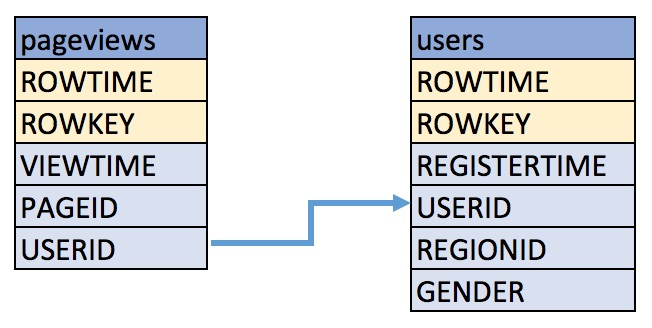

.. _ksql_quickstart:

Quick Start
===========

.. important::

    This release is a developer preview. It is strongly recommended that you test before running KSQL against a production Kafka cluster.

The goal of this quick start is to demonstrate a simple workflow using
KSQL to write streaming queries against data in Kafka.

Setup
-----

.. toctree::
    :maxdepth: 3
    :hidden:

    quickstart-non-docker
    quickstart-docker

Because KSQL queries data in a Kafka cluster, you will need to bring up a Kafka cluster, including ZooKeeper and a Kafka broker.

1. Bring up a Kafka cluster and start KSQL. Follow the instructions based on whether you are using Docker:

    -  :ref:`ksql_quickstart_docker` (recommended)
    -  :ref:`ksql_quickstart_non_docker`

2. After you have successfully started the Kafka cluster and started
   KSQL, you will see the KSQL prompt:

   .. code:: bash

                          ======================================
                          =      _  __ _____  ____  _          =
                          =     | |/ // ____|/ __ \| |         =
                          =     | ' /| (___ | |  | | |         =
                          =     |  <  \___ \| |  | | |         =
                          =     | . \ ____) | |__| | |____     =
                          =     |_|\_\_____/ \___\_\______|    =
                          =                                    =
                          =   Streaming SQL Engine for Kafka   =
       Copyright 2017 Confluent Inc.                         

       CLI v0.1, Server v0.1 located at http://localhost:9098

       Having trouble? Type 'help' (case-insensitive) for a rundown of how things work!

       ksql>

3. KSQL provides a structured query language to query Kafka data, so you
   need some data to query. For this quick start, you will produce mock
   streams to the Kafka cluster.

    -  If you are using our Docker Compose files, a Docker container is
       already running with a data generator that is continuously producing
       Kafka messages to the Kafka cluster. No further action is required.
    -  If you are not using our Docker environment, then follow these
       :ref:`instructions <produce-topic-data>` to
       generate data to the Kafka cluster.

.. _create-a-stream-and-table:

Create a Stream and Table
-------------------------

This KSQL quick start shows examples querying data from Kafka topics
called ``pageviews`` and ``users`` using the following schemas:

Before proceeding, please check:

-  In the terminal window where you started KSQL, you see the ``ksql>``
   prompt
-  If you are not using Docker, you must manually have run the data
   generator to produce topics called ``pageviews`` and ``users``. If
   you haven’t done this, please follow these
   :ref:`instructions <produce-topic-data>`
   to generate data. (Docker compose file automatically runs the data
   generator)

#. Create a STREAM ``pageviews_original`` from the Kafka topic
   ``pageviews``, specifying the ``value_format`` of ``DELIMITED``.
   Describe the new STREAM. Notice that KSQL created additional columns
   called ``ROWTIME``, which corresponds to the Kafka message timestamp,
   and ``ROWKEY``, which corresponds to the Kafka message key.

   .. code:: bash 

        ksql> CREATE STREAM pageviews_original (viewtime bigint, userid varchar, pageid varchar) WITH (kafka_topic='pageviews', value_format='DELIMITED');

        ksql> DESCRIBE pageviews_original;

         Field    | Type
        ----------------------------
         ROWTIME  | BIGINT
         ROWKEY   | VARCHAR(STRING)
         VIEWTIME | BIGINT
         USERID   | VARCHAR(STRING)
         PAGEID   | VARCHAR(STRING)

#. Create a TABLE ``users_original`` from the Kafka topic ``users``,
   specifying the ``value_format`` of ``JSON``. Describe the new TABLE.

   .. code:: bash 

    ksql> CREATE TABLE users_original (registertime bigint, gender varchar, regionid varchar, userid varchar) WITH (kafka_topic='users', value_format='JSON');

    ksql> DESCRIBE users_original;

     Field        | Type
    --------------------------------
     ROWTIME      | BIGINT
     ROWKEY       | VARCHAR(STRING)
     REGISTERTIME | BIGINT
     GENDER       | VARCHAR(STRING)
     REGIONID     | VARCHAR(STRING)
     USERID       | VARCHAR(STRING)

#. Show all STREAMS and TABLES.

   .. code:: bash

       ksql> SHOW STREAMS;

        Stream Name              | Kafka Topic              | Format    
       -----------------------------------------------------------------
        PAGEVIEWS_ORIGINAL       | pageviews                | DELIMITED 

       ksql> SHOW TABLES;

        Table Name        | Kafka Topic       | Format    | Windowed 
       --------------------------------------------------------------
        USERS_ORIGINAL    | users             | JSON      | false   

Write Queries
-------------

**Note:** By default KSQL reads the topics for streams and tables from
the latest offset.

#. Use ``SELECT`` to create a query that returns data from a STREAM. To
   stop viewing the data, press ``<ctrl-c>``. You may optionally include
   the ``LIMIT`` keyword to limit the number of rows returned in the
   query result. Note that exact data output may vary because of the
   randomness of the data generation.

   .. code:: bash

       ksql> SELECT pageid FROM pageviews_original LIMIT 3;
       Page_24
       Page_73
       Page_78
       LIMIT reached for the partition.
       Query terminated
       ksql> 

#. Create a persistent query by using the ``CREATE STREAM`` keywords to
   precede the ``SELECT`` statement. Unlike the non-persistent query
   above, results from this query are written to a Kafka topic
   ``PAGEVIEWS_FEMALE``. The query below enriches the ``pageviews``
   STREAM by doing a ``LEFT JOIN`` with the ``users_original`` TABLE on
   the user ID, where a condition is met.

   .. code:: bash 

    ksql> CREATE STREAM pageviews_female AS SELECT users_original.userid AS userid, pageid, regionid, gender FROM pageviews_original LEFT JOIN users_original ON pageviews_original.userid = users_original.userid WHERE gender = 'FEMALE';

    ksql> DESCRIBE pageviews_female;
     Field    | Type
    ----------------------------
     ROWTIME  | BIGINT
     ROWKEY   | VARCHAR(STRING)
     USERID   | VARCHAR(STRING)
     PAGEID   | VARCHAR(STRING)
     REGIONID | VARCHAR(STRING)
     GENDER   | VARCHAR(STRING)

#. Use ``SELECT`` to view query results as they come in. To stop viewing
   the query results, press ``<ctrl-c>``. This stops printing to the
   console but it does not terminate the actual query. The query
   continues to run in the underlying KSQL application.

   .. code:: bash

       ksql> SELECT * FROM pageviews_female;
       1502477856762 | User_2 | User_2 | Page_55 | Region_9 | FEMALE
       1502477857946 | User_5 | User_5 | Page_14 | Region_2 | FEMALE
       1502477858436 | User_3 | User_3 | Page_60 | Region_3 | FEMALE
       ^CQuery terminated
       ksql> 

#. Create a new persistent query where another condition is met, using
   ``LIKE``. Results from this query are written to a Kafka topic called
   ``pageviews_enriched_r8_r9``.

   .. code:: bash

       ksql> CREATE STREAM pageviews_female_like_89 WITH (kafka_topic='pageviews_enriched_r8_r9', value_format='DELIMITED') AS SELECT * FROM pageviews_female WHERE regionid LIKE '%_8' OR regionid LIKE '%_9';

#. Create a new persistent query that counts the pageviews for each
   region and gender combination in a `tumbling
   window <http://docs.confluent.io/current/streams/developer-guide.html#tumbling-time-windows>`__
   of 30 seconds when the count is greater than 1. Results from this
   query are written to a Kafka topic called ``PAGEVIEWS_REGIONS``.

   .. code:: bash 

    ksql> CREATE TABLE pageviews_regions AS SELECT gender, regionid , COUNT(*) AS numusers FROM pageviews_female WINDOW TUMBLING (size 30 second) GROUP BY gender, regionid HAVING COUNT(*) > 1;

    ksql> DESCRIBE pageviews_regions;

     Field    | Type
    ----------------------------
     ROWTIME  | BIGINT
     ROWKEY   | VARCHAR(STRING)
     GENDER   | VARCHAR(STRING)
     REGIONID | VARCHAR(STRING)
     NUMUSERS | BIGINT

#. Use ``SELECT`` to view results from the above query.

   .. code:: bash

       ksql> SELECT regionid, numusers FROM pageviews_regions LIMIT 5;
       Region_3 | 4
       Region_3 | 5
       Region_6 | 5
       Region_6 | 6
       Region_3 | 8
       LIMIT reached for the partition.
       Query terminated
       ksql> 

#.  Show all persistent queries.

    .. code:: bash

        ksql> SHOW QUERIES;

        Query ID | Kafka Topic              | Query String
        -------------------------------------------------------------------------------------------------------------------------------------------------------------------------------------------------------------------------------------------------------------------------
        1        | PAGEVIEWS_FEMALE         | CREATE STREAM pageviews_female AS SELECT users_original.userid AS userid, pageid, regionid, gender FROM pageviews_original LEFT JOIN users_original ON pageviews_original.userid = users_original.userid WHERE gender = 'FEMALE';
        2        | pageviews_enriched_r8_r9 | CREATE STREAM pageviews_female_like_89 WITH (kafka_topic='pageviews_enriched_r8_r9', value_format='DELIMITED') AS SELECT * FROM pageviews_female WHERE regionid LIKE '%_8' OR regionid LIKE '%_9';
        3        | PAGEVIEWS_REGIONS        | CREATE TABLE pageviews_regions AS SELECT gender, regionid , COUNT(*) AS numusers FROM pageviews_female WINDOW TUMBLING (size 30 second) GROUP BY gender, regionid HAVING COUNT(*) > 1;

Terminate and Exit
------------------

KSQL
~~~~

**Important:** Queries will continuously run as KSQL applications until
they are manually terminated. Exiting KSQL does not terminate persistent
queries.

#. From the output of ``SHOW QUERIES;`` identify a query ID you would
   like to terminate. For example, if you wish to terminate query ID
   ``2``:

   .. code:: bash

       ksql> TERMINATE 2;

#. To exit from KSQL, type ‘exit’.

   .. code:: bash

       ksql> exit

Docker
~~~~~~

If you are running Docker Compose, you must explicitly shut down Docker
Compose. For more information, see the `docker-compose
down <https://docs.docker.com/compose/reference/down/>`__ documentation.

**Important:** This command will delete all KSQL queries and topic data.

::

    $ docker-compose down

Confluent Platform
~~~~~~~~~~~~~~~~~~

If you are running the Confluent Platform, you can stop it with this
command.

::

    $ confluent stop

Next steps
----------

Try the end-to-end :ref:`Clickstream Analysis
demo <ksql_clickstream>`, which shows how
to build an application that performs real-time user analytics.
